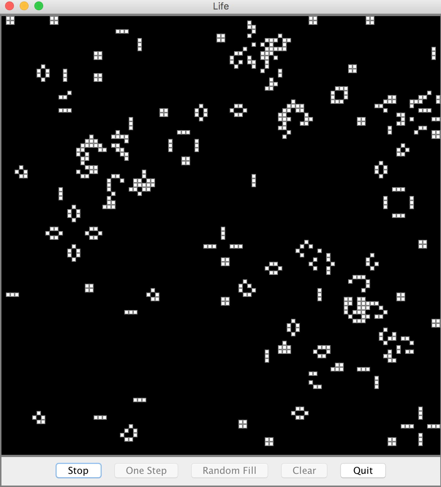

# Game_of_life
a classic zero-player game. Developed in Cooperation with Mr. Sveinson, my high school teacher. 

## Tool Used
Java SE, Java standard libraries
 Swing framework
 IDE: NetBeans

## Notes
- File **Life.java** contains the core functions
- File **MosaicPanel.java** is a GUI class, implemented using Swing 
    

